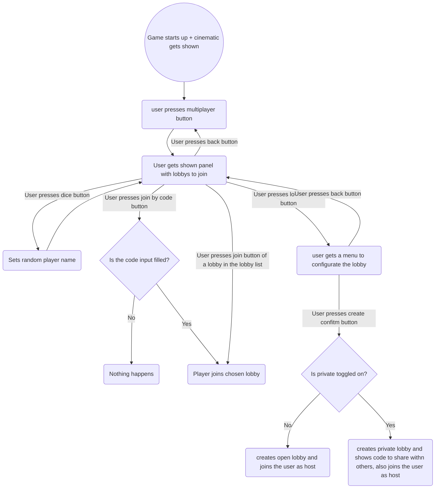
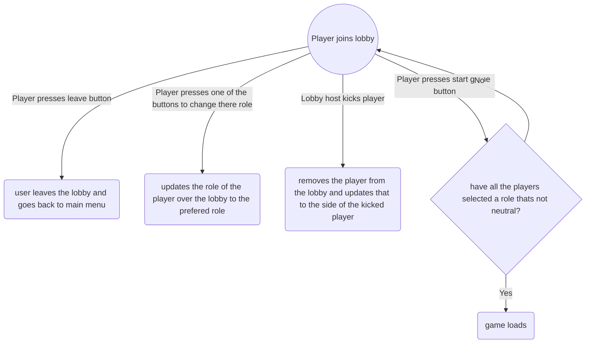
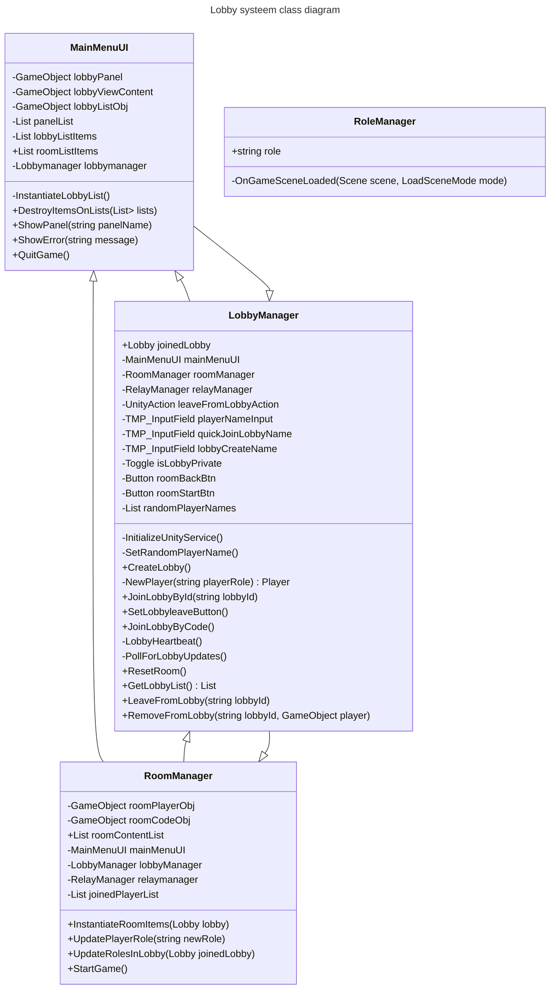
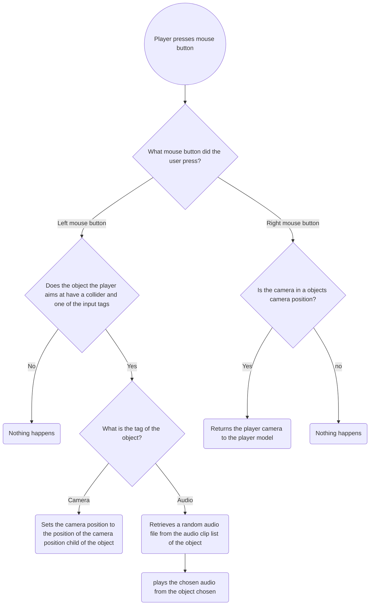

# Examen Repo
# ACCESS DENIED
 

  

## ACCESS DENIED
Voor de gemeente Amsterdam moest een game gerealiseerd worden die hun medewerkers leert bewust te worden over online privacy waarbij onderwerpen als datalekken en persoonsgegevens terug komen. Na het spelen van de game moeten de spelers meer  weten over deze onderwerpen en hoe ze hier mee om kunnen gaan. Ook moest de game makkelijk bereikbaar zijn voor hun medewerkers.

# Geproduceerde Game Onderdelen

Student, Teun:

 - [Lobby systeem](https://github.com/T3rabyte/Examen/tree/1.0/Examen%20Gemeente%20Amsterdam/Assets/Scripts/Menu "Lobby systeem")
 - [Multiplayer intergratie](https://github.com/T3rabyte/Examen/tree/1.0/Examen%20Gemeente%20Amsterdam/Assets/Scripts/Managers/Networking "SingingForgs minigame")
 - [Input systeem](https://github.com/T3rabyte/Examen/tree/1.0/Examen%20Gemeente%20Amsterdam/Assets/Scripts/Controllers "Input systeem")
 

Student, Miguel:

 - [UI implementation](https://github.com/T3rabyte/Examen/tree/US%239_SocialMedia)
 - [social media system](https://github.com/T3rabyte/Examen/tree/US%239_SocialMedia)
 - [quiz system](https://github.com/T3rabyte/Examen/tree/US%2320_mails)
 - [JSON integration](https://github.com/T3rabyte/Examen/tree/US%2320_mails)
 - [Mail system](https://github.com/T3rabyte/Examen/tree/US%2320_mails)
 - [calling for tips mechanic](https://github.com/T3rabyte/Examen/tree/US%236_Tips)
 - [Antivirus installer](https://github.com/T3rabyte/Examen/tree/US%238_AntiVirus)
 - [hacks](https://github.com/T3rabyte/Examen/tree/US%231_PopupAttack)

# Lobby systeem

Om er voor te zorgen dat mensen samen kunnen spelen gebruiken we unity's Lobby package en infrastuctuur. De gebruiker wordt anoniem ingelogd wanneer ze op de samen spelen knop drukken. Waarna ze een overzight krijgen van alle open lobby's die ze zouden kunnen joinen. Ook kunnen ze vanuit daar zelf een lobby aanmaken en prive lobby's joinen aan de hand van een code die de beherder van een lobby krijgt. Wanneer ze een lobby aanmaken of joinen kunnen ze een rol kiezen. Ook is de lobby leider in staat mensen te verwijderen uit de lobby. Zodra iedereen in de lobby een rol heeft gekozen kan de lobby leider de game starten en wordt iedereen naar het game level verplaatst.

# Multiplayer intergratie

Voor het oorspronkelijke concept was het plan dat sommige elementen gesynced werden tussen de 2 spelers. waaronder bijvoorbeeld de kantoor medewerkers positie en rotatie zodat ze hacker hem kon zien bewegen wanneer de hacker zijn camera hacked. Of wanneer de hacker een minigame volbracht er een panalty kwam bij de kantoor medewerker in de voor van een popup of een freeze die de kantoor medewerker hindert te winnen. Hiervoor is gekozen voor Unity's Relay.

# Input systeem

Om het tijdens de game makkelijk te maken voor de spelers om te zien wat er op de monitoren gebeurt is er een script gemaakt dat de camera van de speler op een locatie zet die dichter bij het scherm staat. Later werdt dit script omgebouwd zodat er ook een audio object aangeroepen kan worden.

# Player controller

De player controller is een cruciaal onderdeel van onze game ervaring. Het stelt spelers in staat om vloeiend door de virtuele wereld te navigeren. Met de controller kunnen spelers lopen, rennen, springen in de game. Dankzij de aanpasbaarheid van de controller is het makkelijk om eigenshappen als de snelheid of de speler kan bewegen of roteren.

## Getting Started
To get started with the Cybersecurity Awareness Game simply click on the "downloads" button above.

## How to Play
ACCESS DENIED is a Unity game that can be played on any modern PC. To play the game, simply navigate to the location you downloaded the game and double click the downloaded ACCESS_DENIED.exe file and follow the on-screen instructions.

The game consists of an office where you play as a worker of the municipality of Amsterdam completing different tasks, each of which presents a different cybersecurity threat. The player must navigate through each Task within the allotted time, avoiding threats and answering questions about cybersecurity best practices. The game is designed to be both educational and fun, with engaging graphics and challenging gameplay.

## Questions/Suggestions/Bug Reports
Please read the [Issues List](https://github.com/T3rabyte/Examen/issues) before suggesting a feature. If you have a question, need troubleshooting help, or want to brainstorm a new feature, please start a [Discussion](https://github.com/T3rabyte/Examen/discussions). If you'd like to suggest a feature or report a reproducible bug, please open an [Issue](https://github.com/T3rabyte/Examen/issues/new) on this repository. View the [contributing page](https://github.com/T3rabyte/Examen/blob/main/CONTRIBUTING.md) for more information.

## Contact
If you have any questions or feedback about the ACCESS DENIED, please contact us at miguelafonso939@gmail.com.
